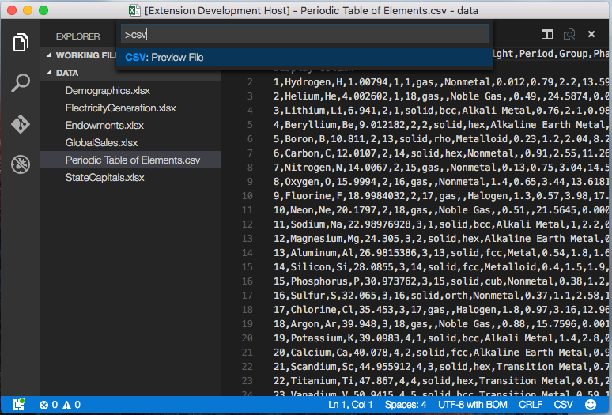
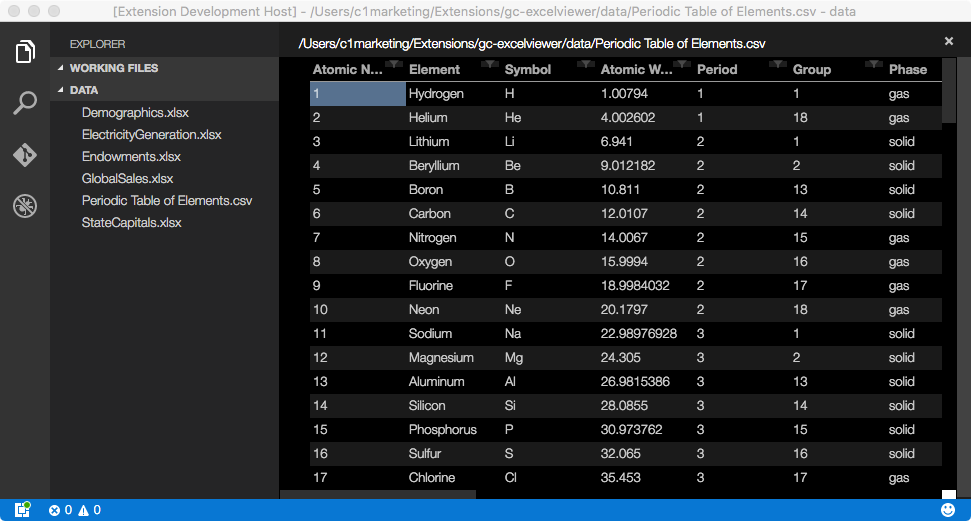
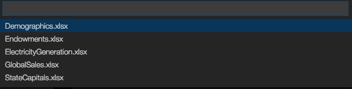
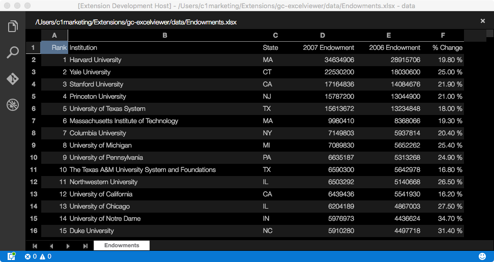

# Excel Viewer
## View Excel spreadsheets and CSV files within Visual Studio code.
Powered by Wijmo, this extension provides read-only viewers for CSV files and Excel spreadsheets within the current workspace.
Open any file with a .csv extension, then execute the command CSV: Preview File.

The preview grid supports sorting and filtering via its column headers.

Since Visual Studio Code does not support opening binary files, the steps are different for Excel spreadsheets.
First, execute the command Excel: Preview File. 

You will be presented with a list of Excel files within the current workspace (including files in subfolders, if any).

Select the desired file to open the spreadsheet viewer.

If multiple sheets are present, use the controls at the bottom of the view for navigation.

### For more information
* [Visual Studio Code's Markdown Support](http://code.visualstudio.com/docs/languages/markdown)
* [Markdown Syntax Reference](https://help.github.com/articles/markdown-basics/)
