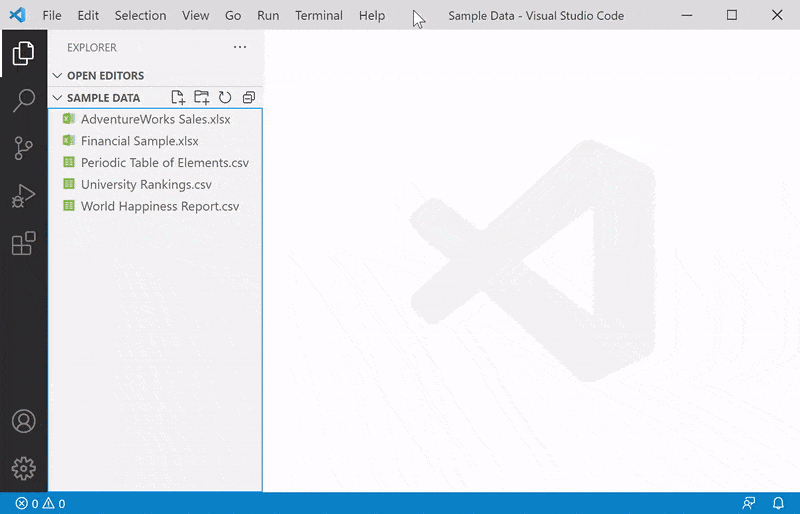
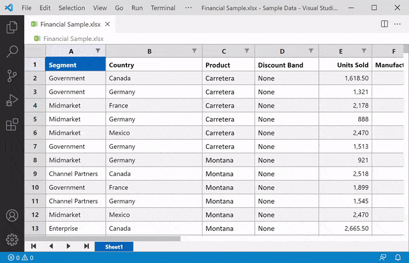
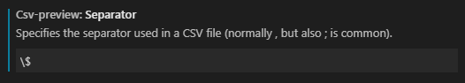

# Excel Viewer
Powered by [Wijmo](http://www.grapecity.com/wijmo), this extension provides read-only viewers for CSV files and Excel spreadsheets in Visual Studio Code and [Visual Studio Code for the Web](https://code.visualstudio.com/docs/editor/vscode-web).

> This extension requires Visual Studio Code 1.62.0 or greater (for pre-release versions, 1.63.0).

Version 4.0 now supports read-only **custom editors**. For Excel files, this is the default, and clicking the name of an Excel file in explorer view opens the custom editor directly. For CSV files, this is optional, and executing the `Open With` command on the context menu prompts for the built-in or custom editor to be opened. The `Open Preview` command is still supported for both file types.

Version 4.0 also adds support for **Visual Studio Code for the Web**. To get started, visit [https://vscode.dev](https://vscode.dev) in your browser.

> As a result of the changes needed to support Visual Studio Code for the Web, persistent previews saved with earlier versions of Excel Viewer cannot be restored. When one of these webviews is activated, the extension displays a message to that effect and provides additional instructions.

## &#128221; *Pre-Release: Editing Support*
Version 4.1.52 extends the custom editors introduced in the latest stable release to include preliminary support for editing CSV and Excel files.

## CSV Usage
For files with a .csv, .tsv, or .tab extension, use the explorer context menu or editor title menu to invoke the `Open Preview` command. The contents of the file will be displayed in a [FlexGrid](http://demos.wijmo.com/5/Angular/Explorer/Explorer/#/grid/intro) control, which supports sorting and filtering via its column headers. You can also use the `Open With` command on the explorer context menu to open a read-only custom editor, as shown here:

For .tsv and .tab files, a tab delimiter is assumed. For plain text files with different extensions, open the file in an editor and execute the `CSV: Open Preview` command from the command palette. For any text file that is open in the built-in editor, regardless of extension, you can right-click its tab and execute the `Reopen Editor With` command, then select the `CSV Viewer` option when prompted.

> Please read [this section](#regex), which describes common customizations to the default configuration for column separators and other settings that affect CSV files.

To sort a column in ascending order, click its column header. To reverse the sort order, click its column header again. To specify a secondary sort column, hold the `Shift` key while clicking its column header. To undo sorting for a column, hold the `Ctrl` key while clicking its column header. Alternatively, you can use the `CSV: Clear Preview State` command to remove all sort/filter criteria for the current file.

## Excel Usage
For files with an .xlsx or .xlsm extension, just click (or double-click) the filename in explorer view. The contents of the file will be displayed in a [FlexSheet](http://demos.wijmo.com/5/Angular/FlexSheetExplorer/FlexSheetExplorer/#/intro) control. If multiple sheets are present, use the controls at the bottom of the view for navigation.

As in earlier versions, you can use the explorer context menu or editor title menu to invoke the `Open Preview` command.

## Theme Support
The extension adapts its display to the current Visual Studio Code theme. For best results, choose a theme with opaque selection background colors.

## Persistent Data
The extension automatically stores user customizations on a per-file, per-workspace basis. For CSV files, this includes column widths, sort/filter criteria, data types, format strings, and scroll bar positions. For Excel files, this includes the selected sheet index, sort/filter criteria, and scroll bar positions associated with that sheet only. If the column structure of a CSV file changes, any persistent data is ignored for that file.

> To discard persistent data for a CSV or Excel file, execute the command `CSV: Clear Preview State`. The preview will be refreshed automatically.

## Numeric Formatting
By default, numeric formatting is always enabled for CSV files, and the extension will examine the first row of data to determine which columns are numeric. The setting `csv-preview.numberFormat` specifies a [.NET-style format string](https://docs.microsoft.com/en-us/dotnet/standard/base-types/standard-numeric-format-strings) that controls the display type and significant digits for all numeric columns. This setting defaults to `g2`, which specifies two significant digits and does not display a thousands separator.

The setting `csv-preview.formatValues` controls how numeric formatting is applied: 

Value | Description
----- | -----------
`always` | All numeric values are formatted according to the `csv-preview.numberFormat` setting. This is the default.
`never` | All values are treated as strings, and no numeric formatting occurs.
`unquoted` | Numeric values are formatted, but only if they are not enclosed in quotes. If a column contains a mixture of quoted and unquoted values, the value in the first data row takes precedence.

> Since data types and format strings are persisted along with other column properties, you may need to run the `CSV: Clear Preview State` command to see the effects of changing the `csv-preview.formatValues` and `csv-preview.numberFormat` options.

## Configuration
To change the default configuration settings for the Excel Viewer extension, edit the user or workspace settings as described [here](http://code.visualstudio.com/docs/customization/userandworkspace#_creating-user-and-workspace-settings). The available settings, which govern CSV files only, are as follows:

Setting | Type | Default Value | Description
------- | ---- | ------------- | -----------
csv-preview.separator | string | , (comma) | Specifies the separator used in a CSV file.
csv-preview.quoteMark | string | "&nbsp;(double&#8209;quote) | Specifies the optional character used to surround individual values in a CSV file.
csv-preview.hasHeaders | boolean | true | Specifies whether the first row in a CSV file represents column headers.
csv-preview.capitalizeHeaders | boolean | true | Specifies whether column headers in CSV files are capitalized.
csv-preview.resizeColumns | string | none | Specifies whether columns are automatically resized to fit the data for CSV files.
csv-preview.lineNumbers | string | none | Specifies whether to display line numbers for CSV files.
csv-preview.commentCharacter | string | # | Specifies the character used to mark comment lines in CSV files.
csv-preview.skipComments | boolean | false | Specifies whether lines that begin with the comment character should be omitted from the CSV preview.
csv-preview.formatValues | string | always | Specifies whether to format numeric values in CSV files, or to treat them as strings.
csv-preview.numberFormat | string | g2 | Specifies a .NET-style format string used to format numeric columns in CSV files.
csv-preview.openStdin | boolean | false | Specifies whether text piped to stdin is automatically opened as a CSV preview.

> Any open CSV previews or custom editors will automatically update to reflect the modified settings, except where noted in the previous section.

### Regular Expression Settings
The following configuration settings are used within regular expressions when processing CSV files. Therefore, you need to escape any special regular expression characters with a backslash in order to achieve the desired result.

 * `csv-preview.separator`
 * `csv-preview.quoteMark`
 * `csv-preview.commentCharacter`

For example, to override the default separator character (comma) with a dollar sign, you would enter the following in the settings editor:

However, if you are editing the `settings.json` file directly, an extra backslash is required:

`"csv-preview.separator": "\\$"`

Likewise, to use a vertical bar as the separator character:

`"csv-preview.separator": "\\|"`

However, if you want to use the tab character as a separator, only one backslash is needed:

`"csv-preview.separator": "\t"`

You can also specify multiple separator characters by using a regular expression character set. For example, to recognize a comma OR a semicolon as a separator, enclose both characters in square brackets:

`"csv-preview.separator": "[,;]"`

Likewise, to use both % and @ as comment symbols (instead of #), do this:

`"csv-preview.commentCharacter": "[%@]"`

Alternatively, to use C# or JavaScript style comments (//), do this:

`"csv-preview.commentCharacter": "/{2}"`

## References
* [About Wijmo](http://www.grapecity.com/wijmo)
* [FlexGrid API](http://www.grapecity.com/wijmo/api/classes/wijmo_grid.flexgrid.html)
* [FlexSheet API](http://www.grapecity.com/wijmo/api/classes/wijmo_grid_sheet.flexsheet.html)
