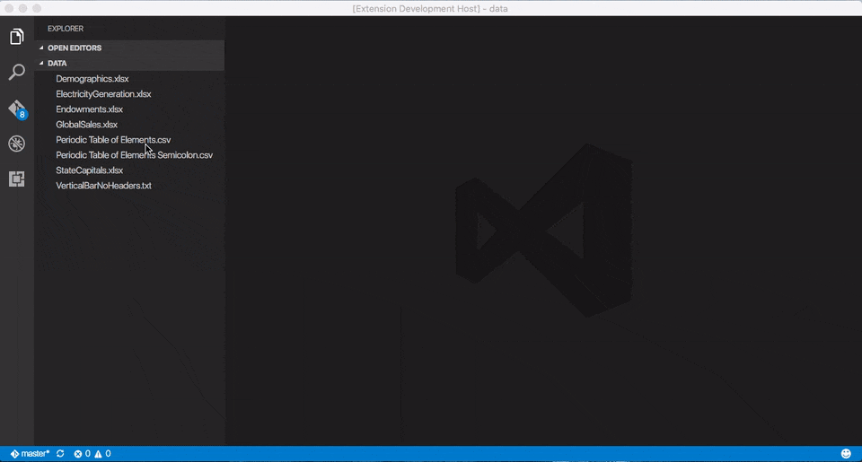
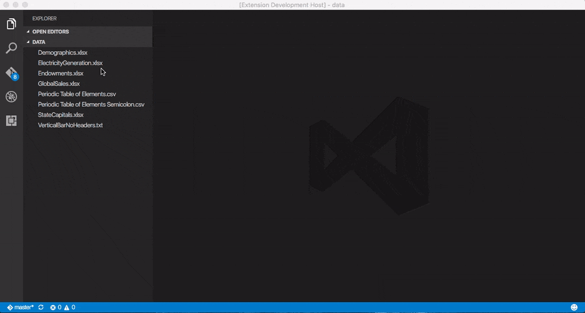

# Excel Viewer
Powered by [Wijmo](http://www.wijmo.com/products/wijmo-5), this extension provides read-only viewers for CSV files and Excel spreadsheets within the current Visual Studio Code workspace. For a deep dive into the implementation details (written prior to the release of Visual Studio Code 1.3), see this [blog post](http://www.wijmo.com/?p=76123).

> This extension requires Visual Studio Code 1.9.1 Recovery Build or greater.

## CSV Usage
For files with a .csv extension, use the explorer context menu or editor title menu to invoke the `Open Preview` command. The contents of the file will be displayed in a [FlexGrid](http://demos.wijmo.com/5/Angular/Explorer/Explorer/#/grid/intro) control, which supports sorting and filtering via its column headers.

For plain text files with different extensions, open the file in an editor and execute the `CSV: Open Preview` command from the command palette.

## Excel Usage
For files with an .xls or .xlsx extension, use the explorer context menu or editor title menu to invoke the `Open Preview` command. The contents of the file will be displayed in a [FlexSheet](http://wijmo.com/products/flexsheet) control. If multiple sheets are present, use the controls at the bottom of the view for navigation.

> As of version 1.1.8, executing the `Excel: Open Preview` command from the command palette no longer displays a dropdown list of Excel files in the current folder, since extensions can now add their own menu commands to the standard Visual Studio Code interface.

## Configuration
To change the default configuration settings for the Excel Viewer extension, edit the user or workspace settings as described [here](http://code.visualstudio.com/docs/customization/userandworkspace#_creating-user-and-workspace-settings). The available settings are as follows:

Setting | Type | Default Value | Description
------- | ---- | ------------- | -----------
csv&#8209;preview.separator | string | , (comma) | Specifies the separator used in a CSV file.
csv&#8209;preview.quoteMark | string | "&nbsp;(double&#8209;quote) | Specifies the optional character used to surround individual values in a CSV file.
csv&#8209;preview.hasHeaders | boolean | true | Specifies whether the first row in a CSV file represents column headers.
csv&#8209;preview.theme | string | cleandark | Specifies the Wijmo theme used to style the preview grid.

> As of version 1.1.9, any open CSV/Excel previews will automatically update to reflect the modified settings.

## Change Log
### 1.1.11
Added a dependency on Visual Studio Code 1.9.1, which fixes issues with blank previews.

Virtual documents now contain well-formed HTML tags.

### 1.1.10
CSV preview now persists column widths and sort/filter criteria.

Excel preview now supports filtering via its column headers. Filter criteria are persisted, but column widths are not.

Upgraded to use Wijmo build 5.20162.198.

### 1.1.9
Fixed bug where the CSV preview did not update automatically when the associated text document was saved. For best results, the `files.autoSave` setting should be set to either `off` (the default) or `onFocusChange`.

Fixed bug where the CSV/Excel preview was always displayed in the left editor group, even if the active document was in the center or right group.

All open CSV/Excel previews now update automatically when the configuration settings are saved. Formerly, an explicit `Reload Window` command was required.

### 1.1.8
This version requires Visual Studio Code 1.3 or greater.

Fixed grid control layout issues that first surfaced in Visual Studio Code 1.3.

Renamed `Preview File` commands to `Open Preview` for consistency with the intrinsic Markdown extension.

CSV preview commands are now available in explorer context menus and editor title menus. This applies to files with .csv extensions only. To preview plain text files with different extensions, open the file in an editor, then execute the `CSV: Open Preview` command from the command palette.

Excel preview commands are now available in explorer context menus and editor title menus. This applies to files with .xls and .xlsx extensions only. Since Visual Studio Code extensions can now contribute menu commands to the standard interface, executing the `Excel: Open Preview` command from the command palette no longer presents a dropdown list of Excel files.

Removed unnecessary vertical scroll bar.

Upgraded to use Wijmo build 5.20162.188.

### 1.0.7
CSV files with double-byte characters are now handled correctly.

### 1.0.6
Relaxed the restriction that CSV files must have a .csv extension. The `CSV: Preview File` command now works with any plain text file.

Added the configuration option `csv-preview.quoteMark` that lets you specify the optional character used to surround individual data values in a CSV file (default: double-quote).

Added the configuration option `csv-preview.hasHeaders` that lets you specify whether the first row in a CSV file represents column headers (default: true).

Added enumerated values for the `csv-preview.theme` configuration option.

### 1.0.5
Fixed local path issues that prevented Excel files from being opened on Windows. If you downloaded an earlier version, please upgrade to version 1.0.5 or later.

@kmp1 added the configuration option `csv-preview.separator` that lets you specify the separator used when reading CSV files (default: comma).

## References
* [About Wijmo](http://www.wijmo.com/products/wijmo-5)
* [FlexGrid API](http://wijmo.com/5/docs/topic/wijmo.grid.FlexGrid.Class.html)
* [FlexSheet API](http://wijmo.com/5/docs/topic/wijmo.grid.sheet.FlexSheet.Class.html)
