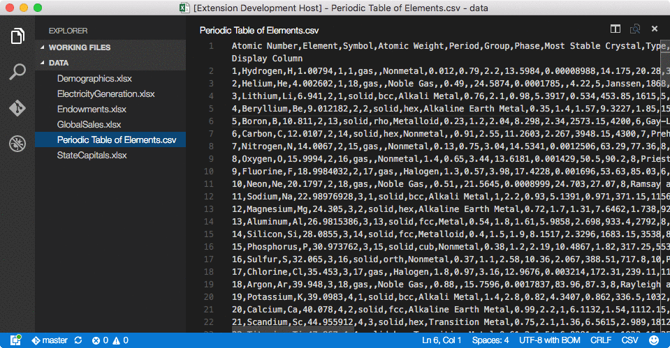
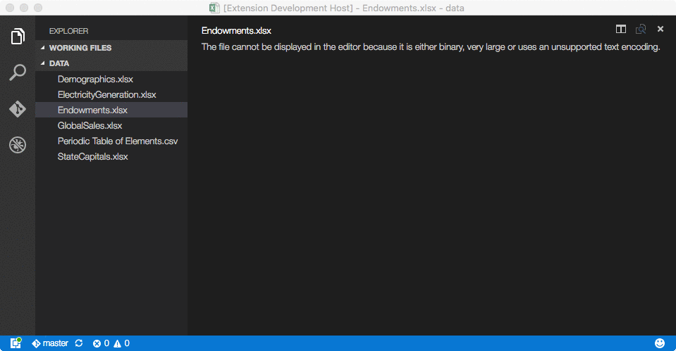

# Excel Viewer
Powered by [Wijmo](http://www.wijmo.com/products/wijmo-5), this extension provides read-only viewers for CSV files and Excel spreadsheets within the current Visual Studio Code workspace.

## CSV Usage
Open any file with a .csv extension, then execute the command `CSV: Preview File`. The contents of the file will be displayed in a [FlexGrid](http://demos.wijmo.com/5/Angular/Explorer/Explorer/#/grid/intro) control, which supports sorting and filtering via its column headers.

## Excel Usage
Since Visual Studio Code does not support opening binary files, the steps are slightly different for Excel spreadsheets. First, execute the command `Excel: Preview File`. You will be presented with a list of Excel files within the current workspace (including files in subfolders, if any). Select the desired file to view it in a [FlexSheet](http://wijmo.com/products/flexsheet) control.

If multiple sheets are present, use the controls at the bottom of the view for navigation.

## Change Log
### 1.0.6
Relaxed the restriction that CSV files must have a .csv extension. The `CSV: Preview File` command now works with any plain text file.

Added the configuration option `csv-preview.quoteMark` that lets you specify the optional character used to surround individual data values in a CSV file (default: double-quote).

Added the configuration option `csv-preview.hasHeaders` that lets you specify whether the first row in a CSV file represents column headers (default: true).

Added enumerated values for the `csv-preview.theme` configuration option.

### 1.0.5
Fixed local path issues that prevented Excel files from being opened on Windows. If you downloaded an earlier version, please upgrade to version 1.0.5 or later.

@kmp1 added the configuration option `csv-preview.separator` that lets you specify the separator used when reading CSV files (default: comma).

## References
* [About Wijmo](http://www.wijmo.com/products/wijmo-5)
* [FlexGrid API](http://wijmo.com/5/docs/topic/wijmo.grid.FlexGrid.Class.html)
* [FlexSheet API](http://wijmo.com/5/docs/topic/wijmo.grid.sheet.FlexSheet.Class.html)
