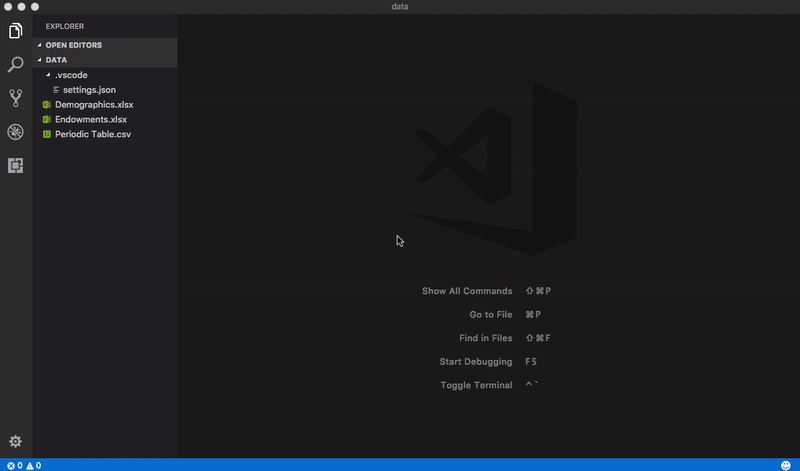
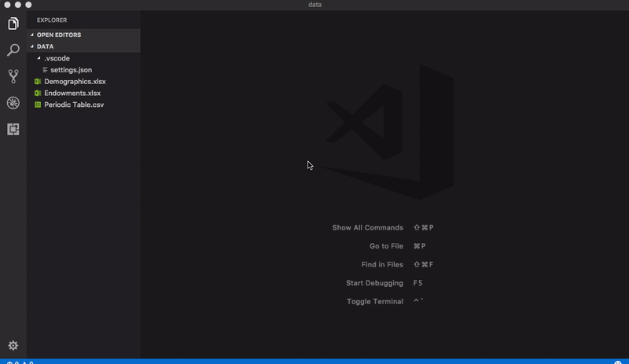

# Excel Viewer
Powered by [Wijmo](http://www.wijmo.com/products/wijmo-5), this extension provides read-only viewers for CSV files and Excel spreadsheets within the current Visual Studio Code workspace.

> This extension requires Visual Studio Code 1.9.1 Recovery Build or greater.

This extension no longer requires access to an external CDN, which prevented it from being used behind a firewall. This version fixes issues where changes to CSV file structure were not immediately reflected in the preview window. It also includes improvements for CSV file parsing, particularly for fields that span multiple lines. New features also include optional line numbers and the ability to comment out lines that begin with a specified character. See the changelog for details.

## CSV Usage
For files with a .csv, .tsv, or .tab extension, use the explorer context menu or editor title menu to invoke the `Open Preview` command. The contents of the file will be displayed in a [FlexGrid](http://demos.wijmo.com/5/Angular/Explorer/Explorer/#/grid/intro) control, which supports sorting and filtering via its column headers.

For .tsv and .tab files, a tab delimiter is assumed. For plain text files with different extensions, open the file in an editor and execute the `CSV: Open Preview` command from the command palette.

## Excel Usage
For files with an .xlsx or .xlsm extension, use the explorer context menu or editor title menu to invoke the `Open Preview` command. The contents of the file will be displayed in a [FlexSheet](http://wijmo.com/products/flexsheet) control. If multiple sheets are present, use the controls at the bottom of the view for navigation.

## Persistent Data
The extension automatically stores user customizations on a per-file, per-workspace basis. For CSV files, this includes column widths, sort/filter criteria, and scroll bar positions. For Excel files, this includes the selected sheet index, sort/filter criteria, and scroll bar positions associated with that sheet only. As of version 2.0.16, if the column structure of a CSV file changes, any persistent data is ignored for that file. This fixes issues where new columns were not displayed unless the file was moved or renamed.

To discard persistent data for a CSV or Excel file, execute the command `CSV: Clear Preview State`, then reopen the preview for the affected file to see the changes.

> Since version 2.0.21 contains bug fixes that depend upon revised column structure, any persistent data for CSV/Excel files saved with earlier versions will be ignored.

## Configuration
To change the default configuration settings for the Excel Viewer extension, edit the user or workspace settings as described [here](http://code.visualstudio.com/docs/customization/userandworkspace#_creating-user-and-workspace-settings). The available settings are as follows:

Setting | Type | Default Value | Description
------- | ---- | ------------- | -----------
csv-preview.separator | string | , (comma) | Specifies the separator used in a CSV file.
csv-preview.quoteMark | string | "&nbsp;(double&#8209;quote) | Specifies the optional character used to surround individual values in a CSV file.
csv-preview.hasHeaders | boolean | true | Specifies whether the first row in a CSV file represents column headers.
csv-preview.capitalizeHeaders | boolean | true | Specifies whether column headers in CSV files are capitalized.
csv-preview.resizeColumns | string | none | Specifies whether columns are automatically resized to fit the data for CSV files.
csv-preview.lineNumbers | boolean | false | Specifies whether to display line numbers for CSV files.
csv-preview.commentCharacter | string | # | Specifies the character used to mark comment lines in CSV files.
csv-preview.skipComments | boolean | false | Specifies whether lines that begin with the comment character should be omitted from the CSV preview.
csv-preview.theme | string | cleandark | Specifies the Wijmo theme used to style the preview grid.

> Any open CSV/Excel previews will automatically update to reflect the modified settings.

## References
* [About Wijmo](http://www.wijmo.com/products/wijmo-5)
* [FlexGrid API](http://wijmo.com/5/docs/topic/wijmo.grid.FlexGrid.Class.html)
* [FlexSheet API](http://wijmo.com/5/docs/topic/wijmo.grid.sheet.FlexSheet.Class.html)
